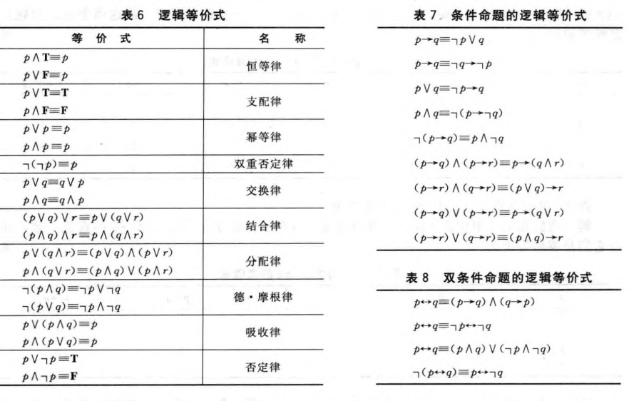

**定义1**$\qquad$一个真值永远是真的复合命题(无论其中出现的命题变元的真值是什么),称为
**永真式**,也称为**重言式**.一个真值永远为假的复合命题称为**矛盾式**, 既不是永真式又不是
矛盾式的复合命题称为**可能式**.

## 逻辑等价式
**定义2**$\qquad$如果$p\leftrightarrow q$是永真式,则复合命题$p$和$q$称为是逻辑等价的.用记号$p\equiv q$表示$p$和$q$是逻辑等价的.

???+ tip "注意"
    符号$\equiv$不是逻辑联结词,$p\equiv q$不是一个复合命题,而是代表“$p\to q$是永真式” 这一语句.
    有时候用符号$\Leftrightarrow$来代替$\equiv$表示逻辑等价。

判定两个复合命题是否等价的方法之一是使用真值表.特别地,复合命题$p$和$q$是等价的当且仅当对应它们真值的两列完全一致

**常用的逻辑等价式**

**定义3$\qquad$合取与析取**  只要$p_1,p_2,\cdots,p_n$为命题,$p_1\vee p_2\vee\cdots\vee p_n$和$p_1\wedge p_2\wedge\cdots\wedge p_n$均有定义.除此以外,德摩根定律可以推广为
$$
\neg(p_1\vee p_2\vee\cdots\vee p_n)\equiv\neg p_1\wedge\neg p_2\wedge\cdots\wedge p_n
$$
和
$$
\neg(p_1\wedge p_2\wedge\cdots\wedge p_n)\equiv\neg p_1\vee\neg p_2\vee\cdots\vee p_n
$$
或简写为$\neg(\bigvee_{j=1}^{n}p_j)\equiv\bigwedge_{j=1}^{n}\neg p_j$和$\neg(\bigwedge_{j=1}^{n}p_j)\equiv\bigvee_{j=1}^{n}\neg p_j$.

## 构造新的逻辑等价式
利用上表中逻辑等价式可以构造出新的命题.

???+ example "例1"
	**试证明** $\neg(p\to q)\equiv p\wedge\neg q$
	
	**证明:**
	
	$$\begin{aligned}
	\neg(p\to q)&\equiv\neg(\neg p\vee q)\\
	&\equiv\neg(\neg p)\wedge\neg q\\
	&\equiv p\wedge\neg q
	\end{aligned}$$

???+ example "例2"
	**试证明** $\neg(p\vee(\neg p\wedge q))\equiv\neg p\wedge\neg q$
	
	**证明:**
	
	$$\begin{aligned}
	\neg(p\vee(\neg p\wedge q))&\equiv\neg p\wedge\neg(\neg p\wedge q)\\
	&\equiv\neg p\wedge(p\vee\neg q)\\
	&\equiv(\neg p\wedge p)\vee(\neg p\wedge\neg q)\\
	&\equiv F\vee(\neg p\wedge\neg q)\\
	&\equiv\vee(\neg p\wedge\neg q)\\
	\end{aligned}$$

## 命题的可满足性
如果存在一个对其变元的真值赋值使其为真,则该复合命题称为是 **可满足的**.反之,则称该符合命题是 **不可满足的**.

当我们找到一个特定的使得复合命题为真的真值赋值时，就证明了它是可满足的。这样的一个赋值称为这个特定的可满足性问题的一个**解**.